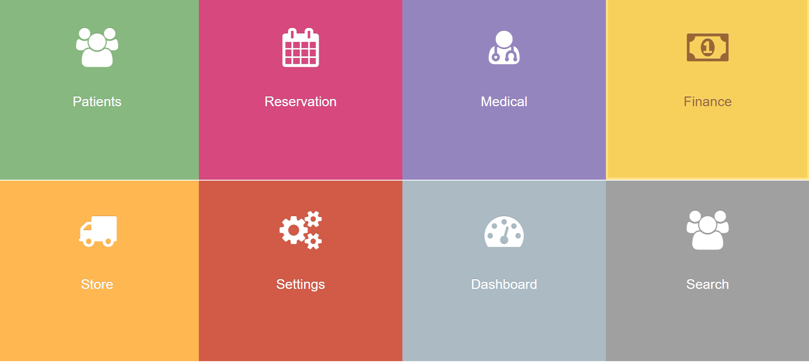

# Clinical Management System

A comprehensive **Clinical Management System** for hospitals and clinics, designed to manage patient data, appointments, diagnostics, medical records, and asynchronous workflows. The system integrates both **structured and unstructured data** for efficient clinical operations.

---

## Overview
**Industry:** Healthcare  
**Role:** Principal Software Engineer & Backend Architect  
**Users:** Doctors, Nurses, Administrative Staff, Hospital Management  

### Business Problem
Hospitals and clinics faced challenges such as:  
- Fragmented patient records across multiple systems  
- Slow appointment scheduling and patient tracking  
- Manual processing of medical reports and lab results  
- Lack of asynchronous workflows for notifications and task management  

---

## Key Features
- Patient registration, profiles, and medical history tracking  
- Appointment scheduling and management  
- Medical diagnostics and lab result integration  
- Dynamic medical records using MongoDB for unstructured data  
- Async workflows with Celery for notifications, report generation, and reminders  
- Role-based access control for staff, doctors, and administrators  
- Reporting dashboards for clinical and administrative metrics  

---

## Architecture & Technologies
- **Backend:** Django, Django REST Framework (DRF)  
- **Async Tasks:** Celery + Redis  
- **Databases:** MySQL (structured data), MongoDB (unstructured medical records)  
- **Frontend:** Vue.js + Bootstrap (optional dashboard UI)  
- **Infrastructure / Deployment:** AWS EC2, S3, RDS  
- **CI/CD:** Docker, GitHub Actions  

>   
> *Placeholder for system architecture diagram*

---

## Key Achievements
- Designed **hybrid database architecture** combining MySQL and MongoDB for flexibility  
- Implemented **asynchronous task workflows** for lab results, notifications, and reporting  
- Streamlined **appointment and patient record management** across multiple departments  
- Built **role-based access** ensuring compliance with privacy regulations (HIPAA-ready)  
- Developed **dynamic dashboards and reports** for clinical and administrative insights  

---

## Impact
- Centralized patient management and streamlined clinic operations  
- Reduced administrative workload and improved data accuracy  
- Enabled real-time notifications and asynchronous task handling  
- Scalable system ready for multiple clinics and hospital departments  

---

## Screenshots / Demo
>   
> *Placeholder for Clinical System dashboard screenshot*

---

## Note on Source Code
This project is enterprise-grade and protected under NDA.  
Source code cannot be shared publicly, but architecture, workflows, and system design are available for discussion.

---

## Contact
📧 ahmedbarakatsamra@gmail.com  
🔗 [LinkedIn](https://linkedin.com/in/ahmed-barakat-dev)  
🔗 [GitHub](https://github.com/ahmedbarakat)
